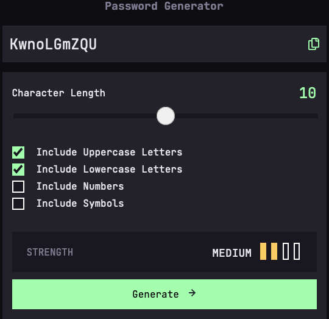

# Frontend Mentor - Password generator app solution

This is a solution to the [Password generator app challenge on Frontend Mentor](https://www.frontendmentor.io/challenges/password-generator-app-Mr8CLycqjh). Frontend Mentor challenges help you improve your coding skills by building realistic projects.

## Table of contents

- [Overview](#overview)
  - [The challenge](#the-challenge)
  - [Screenshot](#screenshot)
  - [Links](#links)
- [My process](#my-process)
  - [Built with](#built-with)
  - [What I learned](#what-i-learned)
  - [Useful resources](#useful-resources)
- [Author](#author)

## Overview

### The challenge

Users should be able to:

- Generate a password based on the selected inclusion options
- Copy the generated password to the computer's clipboard
- See a strength rating for their generated password
- View the optimal layout for the interface depending on their device's screen size
- See hover and focus states for all interactive elements on the page

### Screenshot



### Links

- Solution URL: [Github](https://github.com/nataliesmyth/FEM-pw-generator-app?tab=readme-ov-file)
- Live Site URL: [https://nataliesmyth.github.io/FEM-pw-generator-app/](https://nataliesmyth.github.io/FEM-pw-generator-app/)

## My process

### Built with

- Semantic HTML5 markup
- CSS custom properties
- CSS Utility Classes
- Flexbox
- Mobile-first workflow

### What I learned

I wanted to take a second and talk about a semicolon error.
Originally, my font size classes looked like this:

```css
.fs-600 { font-size: var(--fs-600) };
.fs-500 { font-size: var(--fs-500) };
.fs-400 { font-size: var(--fs-400) };
```

When they should have looked like this:

```css
.fs-600 { font-size: var(--fs-600); }
.fs-500 { font-size: var(--fs-500); }
.fs-400 { font-size: var(--fs-400); }
```

And it took three days to figure it out.
I am very comfortable with CSS, and rarely write a selector declaration on one line. This reminded me how important it is to check your syntax, especially when you are changing your own formatting.

### Useful resources

- [A (more) Modern CSS Reset](https://piccalil.li/blog/a-more-modern-css-reset/) - A comprehensive CSS reset
- [Pure CSS Custom Styled Radio Buttons](https://moderncss.dev/pure-css-custom-styled-radio-buttons/) - This article helped remind me how to style radio inputs, something I haven't done in quite a while.
- [CSS Tricks](https://css-tricks.com/fighting-the-space-between-inline-block-elements/) - helpful for all things CSS, for this project I needed a reminder that space between inline block elements in HTML is rendered in the browser.

## Author

- Website - [Natalie Smyth](https://nataliesmyth.com)
- Frontend Mentor - [@nataliesmyth](https://www.frontendmentor.io/profile/nataliesmyth)
- Twitter - [@itsbirdyperch](https://www.twitter.com/itsbirdyperch)
